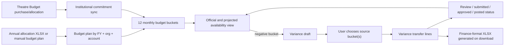

# Future Institutional Budget and Variance App — Handoff

Prepared from the `theatre-budget-app` repository on July 29, 2026.

## 1. Purpose and scope

This document extracts the institutional-budget behavior that already exists in Theatre Budget App and translates it into implementation guidance for a separate future application.

The future application described for this handoff is expected to:

1. Begin a June 1–May 31 fiscal year with allocations entered manually or imported from a Finance file.
2. Accept an Argos CSV after each month closes, or allow users to enter the prior month's actuals manually.
3. Compare allocations, actuals, and previously approved transfers by fiscal year, organization, account, and month.
4. Identify overages and eligible source buckets.
5. Let a user route money from source buckets to over-budget target buckets.
6. Produce Finance's exact variance document.
7. Email the budget owner a secure approval action.
8. On approval, deliver the variance document to Finance and update the application's institutional budget.
9. Give Finance a searchable, sortable, filterable view of every variance and its status.

This repository does **not** implement that entire workflow. It provides a useful institutional budget, variance-routing, workbook-generation, authorization, and audit foundation. Section 10 identifies the missing capabilities.

## 2. Current application architecture

### Runtime and services

- Next.js 15 App Router with TypeScript and React 19.
- Supabase for authentication, PostgreSQL, row-level security, and server-side data access.
- Vercel is the intended hosting platform.
- ExcelJS reads allocation workbooks and writes the variance workbook.
- Resend is used for branded email and magic-link delivery.
- Currency values are stored as PostgreSQL `numeric(12,2)`.
- Core institutional objects live in the `app_theatre_budget` schema in the current database.

Relevant files:

- `package.json`
- `lib/supabase-server.ts`
- `lib/supabase-admin.ts`
- `lib/access.ts`
- `middleware.ts`
- `lib/branded-magic-link.ts`

### Current UI areas

- `/budget-planning`: creates annual/monthly budget plans and imports an institutional allocation XLSX.
- `/institutional-budget`: displays a June–May grid of monthly institutional availability and creates single or bulk shortage variances.
- `/variance`: groups variance requests by status, selects source buckets, records transfer lines, changes status, and makes an XLSX available.
- `/login`: Google authentication or emailed magic link.

### High-level current flow



## 3. Current institutional budget model

### Fiscal year

Fiscal years have an ID, name, start date, end date, status, and sort order. Institutional logic resolves the fiscal year from the transaction date by finding the row whose start/end dates contain that date.

The current institutional feature assumes a June–May sequence:

- June is fiscal month 1.
- July is fiscal month 2.
- …
- May is fiscal month 12.

Do not hard-code June everywhere in the future app. Store the fiscal-year start and end dates and derive the twelve periods, even if the initial business rule remains June 1–May 31.

### Organization and account identities

The institutional key is:

`fiscal_year + organization + account_code + month`

Current behavior treats organizations as fiscal-year-specific records. When a purchase refers to an organization from another fiscal year, the sync tries to find the organization with the same `org_code` in the transaction's fiscal year.

Account code identity is intended to be based on the Finance code, not a UI label. Current sync code attempts to normalize account IDs through the account's `code`, but warns and retains the original ID if multiple IDs have the same code.

For the future app:

- Give Finance codes durable canonical identities.
- Treat names/descriptions as editable metadata, not identity.
- Decide whether organizations are canonical across years or versioned per year; do not mix both approaches.
- Enforce uniqueness at the database level.

### `budget_plans`

One annual plan exists for each:

`fiscal_year_id + organization_id + account_code_id`

Important fields:

- `annual_amount`
- `source_fiscal_year_id`
- `created_by_user_id`
- `updated_by_user_id`
- timestamps

The current schema enforces a unique row for that composite key and requires a non-negative annual amount.

Source:

- `supabase/migrations/202603301200_budget_planning_module.sql`

### `budget_plan_months`

Each budget plan has twelve month rows:

- `budget_plan_id`
- `month_start`
- `fiscal_month_index` from 1 through 12
- `amount`
- `percent`
- `source`: `historical`, `manual`, or `even`
- timestamps

The database enforces one row per plan/month, non-negative amounts, and a percentage from 0 through 1.

In the current planning module:

- A user can manually edit monthly values.
- The annual amount is recomputed from the twelve months.
- If historical values exist, a new annual plan can be distributed across months in the same proportions.
- Otherwise, the annual amount is divided evenly.
- Calculations use integer cents and deterministic remainder distribution to avoid rounding drift.

For the future app, the starting allocation should be immutable or versioned after the fiscal year is opened. Variances should be a ledger layered over the original allocation rather than destructive edits with no history.

### Current allocation import

The current importer is administrator-only and accepts `.xlsx`, not CSV.

It:

1. Accepts fiscal-year name, start/end dates, and an optional expected total.
2. Locates a worksheet other than `Instructions` or `Template`.
3. Searches the first 20 rows for at least eight recognizable June–May month headers.
4. Recognizes five-digit account codes.
5. Uses organization headings to associate subsequent account rows with an organization.
6. Builds a preview with:
   - errors,
   - warnings,
   - total by organization,
   - total by month,
   - grand total,
   - optional comparison to an expected grand total.
7. Prevents commit when preview errors exist.
8. On commit, upserts the fiscal year, organizations, account codes, annual plans, and month rows.

Current hard-coded defaults are FY27, June 1, 2026–May 31, 2027, and organizations `2AC200` and `2AC230`. Those values are Theatre-specific and must not be copied into a general application.

Relevant files:

- `app/budget-planning/institutional-allocation-import-panel.tsx`
- `app/budget-planning/actions.ts`

Reusable import pattern:

`upload -> parse -> normalize -> preview -> validate totals -> explicit commit`

The future app should preserve that two-step import pattern for both opening allocations and monthly Argos actuals.

## 4. Current spending/actuals behavior

The current app does not have an Argos upload or a manual month-close actuals table.

It has two related concepts:

### Historical planning actuals

`v_monthly_actuals_by_org_account` derives monthly obligated values from Theatre Budget purchase records. Depending on purchase status, it includes requested, encumbered, pending-card, or posted amounts and proportionally distributes a purchase across its allocation lines.

This view is used as historical guidance for planning, not as an externally certified Finance actuals import.

Relevant files:

- `supabase/migrations/202603311200_budget_planning_use_obligated.sql`
- `lib/db.ts` (`getHistoricalMonthlyActuals`)

### Institutional commitments

`institutional_budget_commitments` maps Theatre Budget purchases to an institutional month bucket.

Important fields:

- purchase and purchase-allocation IDs,
- fiscal year,
- organization,
- account code,
- budget-plan month,
- order date,
- committed amount,
- status: `submitted`, `adjusted`, or `cancelled`,
- timestamps.

Current purchase amount selection:

- cancelled purchase → zero;
- posted → posted amount;
- pending credit card → pending-card amount;
- encumbered → encumbered amount;
- requested → requested amount, falling back to estimated amount.

The date preference is `ordered_on`, then `purchase_date`, then `created_at`. Contract installment code can set the order date based on mail/AP/due dates.

The sync:

1. Resolves transaction date and fiscal year.
2. Resolves the matching fiscal-year organization.
3. Resolves account code and purchase allocations.
4. Finds the plan/month bucket.
5. Upserts commitments by purchase allocation.
6. Cancels obsolete commitment rows.
7. Recalculates availability.
8. Creates or updates a shortage variance draft when needed.

Relevant files:

- `lib/institutional-budget.ts`
- `supabase/migrations/202606090900_fy27_institutional_budget.sql`
- `supabase/migrations/202607122245_institutional_commitment_diagnostics.sql`

The diagnostic view is worth reproducing conceptually. It reports missing allocation, organization, date, fiscal year, account, plan, month, or commitment mappings instead of silently dropping unmatched records.

## 5. Current availability and variance calculations

The central read model is `v_institutional_monthly_budget_availability`.

For each FY/org/account/month bucket:

```text
official available
  = monthly allocation
  + approved incoming variances
  - approved outgoing variances
  - active institutional commitments

projected available
  = monthly allocation
  + incoming variances in draft/review/submitted/approved/posted
  - outgoing variances in draft/review/submitted/approved/posted
  - active institutional commitments
```

Denied variances are excluded.

The current shortage calculation is:

```text
shortage = abs(min(official available, projected available, 0))
```

This means a bucket can require a variance when either official or projected availability is negative. A pending outgoing transfer can therefore cause another shortage before the first variance is approved.

For the future Argos-based app, use separate, unambiguous values:

```text
opening allocation
+ approved incoming transfers
- approved outgoing transfers
= current revised budget

current revised budget
- imported cumulative actuals (or actuals + encumbrances, per Finance rule)
= available balance

available balance
- pending outgoing transfers
+ pending incoming transfers
= projected available balance
```

Finance must decide whether the Argos file contains:

- monthly activity,
- fiscal-year-to-date actuals,
- commitments/encumbrances,
- available balance,
- or more than one of these.

Never add multiple YTD uploads together. If Argos exports YTD values, store snapshots and calculate the month's delta only when needed.

## 6. Current variance domain and workflow

### `variance_requests`

Important fields:

- fiscal year,
- optional triggering purchase,
- optional single target month (legacy/single-target compatibility),
- status,
- reason,
- required transfer amount,
- generated file path and URL,
- creator,
- submitted/approved/posted/denied timestamps,
- created/updated timestamps.

Current statuses:

`draft -> ready_for_review -> submitted -> approved/denied -> posted`

The current application does not strictly enforce that sequence. It allows role-permitted users to choose statuses from a list. The database only gives special protection to `approved` and `posted`.

### `variance_request_targets`

A variance can cover multiple shortage buckets. Each target stores:

- variance request,
- target budget-plan month,
- organization,
- account,
- month,
- shortage amount.

There is one target row per variance/bucket.

Source:

- `supabase/migrations/202607122320_variance_request_targets.sql`

### `variance_request_lines`

Each line transfers money from one bucket to one target bucket and stores:

- source and destination budget-plan month IDs,
- source and destination organization IDs,
- source and destination account IDs,
- source and destination month dates,
- transfer amount,
- narrative,
- whether cross-organization movement was explicitly overridden,
- timestamps.

Database rules:

- amount must be greater than zero;
- source and target bucket cannot be identical;
- organizations must match unless the cross-org override is true.

Current application rules:

- lines are editable only in `draft` or `ready_for_review`;
- source projected balance must cover the transfer;
- the same source/target pair cannot be added twice;
- cross-org movement requires a checkbox;
- a request needs at least one source line before `ready_for_review`;
- over-sourcing requires a manual override before `ready_for_review`;
- a fully sourced target cannot receive another line unless a line is first removed.

The source-candidate search:

- returns positive official balances;
- can filter by FY, org, account, month, and free-text;
- defaults to the target organization;
- optionally includes cross-org buckets;
- presents same-FY/same-org/fully-covering candidates first;
- shows official and projected availability.

Important future rule: explicitly prohibit cross-fiscal-year transfers unless Finance states otherwise. The present UI prefers same-year candidates, but the line-creation action does not enforce matching fiscal years.

### `variance_events`

The audit table stores:

- request ID,
- previous status,
- next status,
- actor,
- note,
- timestamp.

The app also writes same-status events for source-line additions/removals.

For the future app, expand the audit model to cover:

- import preview and commit,
- manual actual edits,
- approval email delivery,
- link opening,
- approval/denial,
- document generation and its content hash,
- Finance delivery attempts,
- Finance acknowledgement/posting,
- any reversal or superseding variance.

## 7. Current variance document generation

The current output is XLSX, not CSV.

Template:

- `public/templates/variance-template.xlsx`
- expected worksheet: `Template`
- an `Instructions` sheet may also exist.

Generator:

- `lib/variance-workbook.ts`
- download route: `app/variance/[varianceId]/workbook/route.ts`

The template mapping is fixed:

- Requestor: `B4`
- Approved by: `B5`
- Date: `B6`
- First variance block starts at row 8.
- Each transfer line uses a six-row block.
- “Remove” data is written one row below the block header.
- “Move” data is written two rows below the block header.
- Narrative is written three rows below and merged across columns F:T.
- Month columns run June in H through May in S.
- Total is column T.

Each transfer line writes:

- from/to fund and description,
- from/to organization and description,
- from/to account and description,
- amount in the relevant fiscal-month column,
- amount in the total column,
- narrative.

Current limitations:

- Fund fields are left blank by the route.
- `Approved By` is left blank even for approved requests.
- The date is the download/generation date.
- The requestor comes from the creator's local user record.
- File metadata is saved on the variance, but the actual workbook is generated dynamically on download rather than persisted to storage.
- There is no immutable document version or content hash.
- There is no automatic attachment delivery to the owner or Finance.
- Production throws an error if the bundled template is missing or unreadable; local development can use a basic fallback.

For the future app, treat the exact Finance variance specification as a versioned adapter:

- `document_format_version`
- template/source file checksum
- generated artifact checksum
- generation timestamp
- source data snapshot
- immutable copy of all display labels and codes

If Finance truly requires CSV, obtain and test the exact header names, order, encoding, delimiter, date format, sign convention, and whether one transfer requires one or two rows. Do not assume the existing XLSX mapping describes that CSV.

## 8. Current access, authentication, and email patterns

### Authentication

- Supabase Auth supports Google sign-in.
- The app can generate a branded one-time magic link.
- Middleware redirects unauthenticated users to login.
- Magic-link requests are enumeration-resistant: the endpoint returns the same accepted response whether access exists or not.
- Email and client-address rate limiting exists, although it is currently in process memory.

### Authorization

Current relevant effective roles:

- `admin`
- `project_manager`
- `viewer`
- `procurement_tracker`

Historical database enum/code also contains `buyer`, which current access code normalizes to viewer.

The institutional and variance pages require `admin` or `project_manager`.

- Admin or project manager can create and edit variance drafts.
- Only admin can approve or post.
- Row-level security additionally scopes access by project membership or `user_access_scopes` dimensions such as fiscal year and organization.
- Authorization is checked in both application actions and database policies/triggers.

For the future app, use purpose-specific roles:

- budget contributor,
- budget owner/approver,
- Finance reviewer,
- Finance administrator,
- system administrator,
- optional read-only auditor.

Do not equate system administrator with budget owner approval. Store the designated owner per organization/budget and preserve delegated-approver rules.

### Email

The current email utility uses Resend with:

- `RESEND_API_KEY`
- `MAGIC_LINK_FROM_EMAIL`
- HTML and plain-text versions
- an idempotency header

The existing idempotency key includes a random UUID, so it does not prevent logical duplicate sends. The future workflow should use a stable key such as:

`variance-owner-request:<variance_id>:<document_version>`

Relevant file:

- `lib/branded-magic-link.ts`

For approval links:

- Store only a hash of a random approval token.
- Bind it to one variance, one approver, one document version, one allowed action set, and an expiry.
- Make it single-use.
- Show the full transfer summary before approval.
- Use an atomic database operation that verifies token, status, approver, expiry, and document version before changing state.
- Require authenticated login if institutional policy demands it; otherwise a signed one-time link can support “click and approve.”
- Do not approve on a GET request. The link should open a confirmation page and approval should be a POST.

## 9. What can be reused conceptually

Strong patterns to carry forward:

1. Composite institutional buckets by FY/org/account/month.
2. Separate annual plan and twelve monthly rows.
3. Preview-before-commit imports with reconciliation totals.
4. Original allocation plus a variance ledger instead of opaque balance edits.
5. Separate official and projected availability.
6. Explicit shortage targets and source-to-target transfer lines.
7. Database constraints for monetary and cross-org rules.
8. Application checks plus database row-level security.
9. Immutable event/audit records.
10. A fixed, tested document-template mapping.
11. A diagnostics view for unmatched import/source records.
12. Server-side authorization before document download.
13. Currency rounding in cents.
14. Multi-target variances when one monthly close produces several overages.

Code that is useful as a reference but should be adapted rather than copied unchanged:

- `lib/institutional-budget.ts`
- `lib/variance-workbook.ts`
- `app/institutional-budget/actions.ts`
- `app/variance/actions.ts`
- `app/variance/page.tsx`
- `app/variance/variance-center-client.tsx`
- `app/budget-planning/actions.ts`
- the institutional migrations listed in Section 15.

## 10. Required future capabilities that do not exist here

The future app still needs:

- opening-allocation CSV ingestion;
- generic organization support rather than hard-coded Theatre orgs;
- Argos CSV schema mapping;
- import-batch history and stored original files;
- detection of duplicate/replayed monthly files;
- manual monthly actual entry;
- explicit month-close/lock behavior;
- actuals corrections and restatement history;
- reconciliation between imported rows and canonical org/account codes;
- budget-owner records and delegation;
- one-click owner approval flow;
- approval token storage, expiry, revocation, and single-use behavior;
- automatic variance document generation at submission/approval;
- automatic owner email;
- automatic Finance email/delivery;
- durable delivery retries and failure monitoring;
- Finance-wide dashboard with filter/sort/search/export;
- Finance acknowledgement or posting state;
- immutable generated document versions;
- notification/audit history;
- deadline reminders and overdue-month monitoring;
- safe reversal/supersession rather than editing a posted variance;
- tests for imports, formulas, authorization, state transitions, and concurrent approvals.

No current scheduled monthly job exists. A future scheduler should create reminders or open month-close tasks, but users should still control when a period is ready because Argos availability and Finance close timing may vary.

## 11. Recommended future data model

Names are illustrative.

### Master and access data

- `users`
- `organizations`
- `organization_memberships`
- `budget_owners`
- `approval_delegations`
- `fiscal_years`
- `fiscal_periods`
- `funds`
- `account_codes`
- optional `programs` and full FOAPAL dimensions

### Opening budget

- `allocation_import_batches`
  - source filename, checksum, uploaded by/at, FY, status, raw artifact location, parser version
- `allocation_import_rows`
  - raw row, normalized keys, amount, validation state/error
- `opening_allocations`
  - FY/org/fund/account/period and amount
- `allocation_versions`
  - optional snapshot/version if Finance can replace an opening file

### Monthly actuals

- `actual_import_batches`
  - FY, period, Argos “as of” timestamp, file checksum, mode (`monthly` or `ytd`), status
- `actual_import_rows`
  - raw columns plus normalized dimensions and amounts
- `actual_snapshots`
  - canonical period/YTD values from each accepted import
- `manual_actual_adjustments`
  - delta, reason, actor, timestamp, superseded record
- `period_close_status`
  - not started, uploaded, needs reconciliation, ready, submitted, locked, reopened
- `import_reconciliation_issues`
  - unknown account/org, duplicate, invalid amount, unexpected total, missing expected bucket

Do not overwrite accepted actual snapshots. Mark a newer batch as superseding the earlier one.

### Variances

- `variance_requests`
  - request number, FY/period, owner, status, reason, totals, current document version
- `variance_targets`
  - overage bucket and required amount captured at creation
- `variance_lines`
  - exact from/to dimensions and amount
- `variance_events`
- `variance_document_versions`
  - generated file, checksum, format version, source-data snapshot
- `approval_requests`
  - approver, token hash, expiry, status, sent/acted timestamps, document version
- `delivery_outbox`
  - message type, logical idempotency key, recipient, artifact, attempts, next attempt, last error
- `finance_receipts`
  - delivered/acknowledged/posted metadata

### Recommended revised-budget ledger

Use approved variance lines as ledger entries. Compute:

`revised budget = opening allocation + approved incoming - approved outgoing`

Do not update the opening allocation itself. If a fast query needs a materialized balance, rebuild it from the ledger or update it transactionally while retaining the ledger as source of truth.

## 12. Recommended state machines

### Monthly import

`uploaded -> validating -> needs_reconciliation -> accepted -> locked`

Allow:

- `needs_reconciliation -> validating`
- `accepted -> superseded`
- controlled `locked -> reopened`

### Variance

`draft -> ready_for_owner -> owner_approval_pending -> approved | denied`

Then:

`approved -> finance_delivery_pending -> delivered_to_finance -> finance_acknowledged -> posted`

Failure/support states:

- `owner_delivery_failed`
- `finance_delivery_failed`
- `expired`
- `cancelled`
- `superseded`

Enforce allowed transitions in one database function or transaction. Record every transition and actor. Generate/lock the owner-reviewed document before sending the approval request; if financial lines change, revoke the old approval request and create a new document version.

## 13. Critical validation and transaction rules

At minimum:

- All source and target buckets belong to the same fiscal year unless Finance explicitly allows otherwise.
- Transfer amount is positive and represented exactly to cents.
- Source and destination differ.
- Total outgoing lines equal total incoming lines for each variance.
- A source cannot be overdrawn after considering other pending reservations.
- Source eligibility rules are configurable by account/fund/organization, not merely “positive balance.”
- A target cannot be funded beyond the permitted tolerance without an auditable override.
- A posted/Finance-acknowledged variance is immutable.
- Approval applies to an exact document/data version.
- Only the designated owner/delegate can approve.
- An approval token is single-use and expires.
- Approval, ledger posting, document finalization, and Finance outbox creation occur atomically.
- Import commit is idempotent by checksum plus FY/period/source-system identity.
- Concurrent imports and approvals use database locks or compare-and-swap version checks.
- Manual actual changes require a reason and never erase the imported value.
- Every exported artifact can be reproduced from stored source values and format version.

## 14. Finance dashboard requirements

The current Variance Center groups cards by status but is not the requested Finance sheet.

Recommended Finance table columns:

- variance/request number,
- fiscal year and period,
- organization,
- budget owner,
- requester,
- created/submitted/approved/delivered/posted dates,
- total amount,
- source account(s),
- target account(s),
- current status,
- age in status,
- delivery failure indicator,
- document version,
- Finance acknowledgement/reference number.

Filters:

- status,
- fiscal year,
- period,
- organization,
- owner/requester,
- source or target account,
- amount range,
- submitted/approved date range,
- delivery exception,
- overdue/age.

Support stable sorting, pagination, saved views, CSV export of dashboard rows, and a detail drawer/page showing lines, document versions, email history, and audit events.

Finance access should span all organizations; owners should see only their assigned budgets and requests.

## 15. Repository file inventory

### Core institutional and variance logic

- `lib/institutional-budget.ts`
- `lib/variance-workbook.ts`
- `app/institutional-budget/page.tsx`
- `app/institutional-budget/actions.ts`
- `app/variance/page.tsx`
- `app/variance/variance-center-client.tsx`
- `app/variance/actions.ts`
- `app/variance/[varianceId]/workbook/route.ts`
- `public/templates/variance-template.xlsx`
- `public/templates/README.md`

### Allocation planning/import

- `app/budget-planning/page.tsx`
- `app/budget-planning/actions.ts`
- `app/budget-planning/institutional-allocation-import-panel.tsx`
- `app/budget-planning/budget-planning-export.tsx`
- `lib/db.ts`

### Database definitions

- `supabase/migrations/202603301200_budget_planning_module.sql`
- `supabase/migrations/202603311200_budget_planning_use_obligated.sql`
- `supabase/migrations/202606090900_fy27_institutional_budget.sql`
- `supabase/migrations/202606091030_institutional_budget_variance_target_bucket.sql`
- `supabase/migrations/202607122245_institutional_commitment_diagnostics.sql`
- `supabase/migrations/202607122320_variance_request_targets.sql`

### Access and email

- `lib/access.ts`
- `middleware.ts`
- `lib/branded-magic-link.ts`
- `lib/budget-access-invite.ts`
- `app/api/auth/magic-link/route.ts`
- `app/auth/callback/route.ts`

## 16. Known caveats in the current repository

These should be resolved or avoided before treating current files as production-ready templates:

1. `supabase/migrations/202607122250_institutional_identity_indexes.sql` contains only the single character `A`; it is not a valid migration.
2. `202603301200_budget_planning_module.sql` is labeled “DO NOT APPLY YET,” despite later code depending on its objects. Deployment history must be verified rather than inferred from filenames.
3. The institutional migration's source-candidate function should be reviewed against the deployed database; the checked-in SQL appears to have a mismatched/duplicated select field in the function body.
4. There are no focused automated tests for institutional imports, availability formulas, variance routing, workbook output, or variance authorization.
5. Status changes are not a strict state machine.
6. Cross-fiscal-year sources are not explicitly rejected by the action.
7. `Approved By` and fund fields are not populated in the workbook.
8. “Generate workbook” stores path/URL metadata, while the download route generates the workbook live.
9. The current role model is Theatre/project-oriented and does not model a designated institutional budget owner.
10. The email helper is reusable, but durable queues, stable logical idempotency, retries, delivery events, and alerting are absent.

## 17. Decisions Finance/business owners must provide

Before implementation, obtain:

1. A real opening-allocation file and data dictionary.
2. A real Argos export for at least two consecutive months.
3. Confirmation whether Argos amounts are monthly or YTD.
4. The exact balance formula, including encumbrances and commitments.
5. Source-bucket eligibility rules.
6. Whether transfers may cross organization, fund, account class, program, or fiscal month.
7. Whether transfers may ever cross fiscal years (recommended default: no).
8. The exact variance CSV/XLSX template and example accepted by Finance.
9. Required sign convention and rounding/tolerance.
10. Who owns each budget and how delegates/absences work.
11. Whether approval links require login.
12. Approval expiry and reminder/escalation rules.
13. Finance delivery address or system endpoint.
14. What “sent to Finance,” “accepted,” and “posted” each mean.
15. Whether Finance or the application is the system of record for revised budgets.
16. Correction/reversal rules after owner approval or Finance posting.
17. Data retention and audit requirements.

## 18. Suggested acceptance tests

High-value end-to-end scenarios:

1. Import opening allocations, preview totals, commit once, and safely reject/reconcile a duplicate.
2. Upload month-one Argos actuals with an unknown code and prevent acceptance until mapped.
3. Upload consecutive YTD files and prove values are not double-counted.
4. Manually correct an actual with a reason and preserve both imported and adjusted values.
5. Detect an overage and show only eligible source buckets.
6. Reject a transfer that would overdraw a source after pending reservations.
7. Prevent cross-FY transfer.
8. Route several sources to one target and one source to several targets.
9. Generate the exact Finance document and compare cell/column values to a golden fixture.
10. Email the correct owner once, expire/revoke the token correctly, and prevent replay.
11. Change a line after preparing approval and prove the old approval link no longer works.
12. Approve concurrently from two browser sessions and record only one successful transition.
13. Atomically approve, post the variance ledger effect, create the final artifact, and queue Finance delivery.
14. Retry a failed Finance delivery without sending duplicate logical submissions.
15. Filter and sort Finance's dashboard across organizations and statuses.
16. Reverse/supersede a posted variance without editing the original audit record.

## 19. Recommended implementation order

1. Confirm Finance file formats, formulas, source restrictions, roles, and state definitions.
2. Build canonical FY/period/org/fund/account master data and access model.
3. Implement opening-allocation import with preview, validation, versioning, and audit.
4. Implement Argos monthly/YTD import, reconciliation, snapshots, manual adjustments, and period locks.
5. Build revised-budget and official/projected availability read models.
6. Implement variance targets, source reservations, lines, invariants, and strict state transitions.
7. Implement versioned Finance document generation with golden-file tests.
8. Implement owner approval requests and secure tokens.
9. Add durable owner/Finance notification outbox, retries, and delivery audit.
10. Build the Finance dashboard and acknowledgement/posting workflow.
11. Add monitoring, reminders, reversals, security tests, and disaster-recovery procedures.

The most important design principle is to preserve the financial history: opening allocations, accepted actual snapshots, manual adjustments, variance lines, approvals, documents, and deliveries should be versioned ledger/audit records. The displayed institutional budget can then be recalculated and explained at any point in time.
